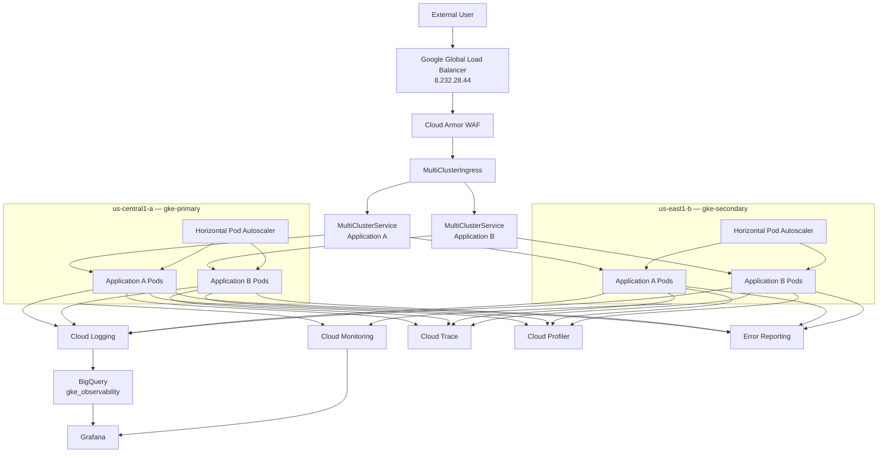

# Architecture

## Overview

This project implements a multi-region Google Kubernetes Engine architecture with two stateless web applications deployed across two GKE Standard clusters.

The environment is managed through Terraform and GitHub Actions and includes global traffic distribution, security controls, centralized logging, monitoring, tracing, profiling, error reporting, BigQuery log analytics, and Grafana visualization.

## High-Level Architecture

## Project and Networking

- Project: `gcp-gke-assessment`
- VPC: `gke-assessment-vpc`
- Primary subnet: `gke-primary-subnet`
- Secondary subnet: `gke-secondary-subnet`
- Private Google Access enabled
- Private Service Access configured
- Cloud NAT configured in both regions
- VPC Flow Logs enabled
- Firewall rules managed through Terraform

Both GKE clusters are VPC-native and use secondary IP ranges for Pods and Services.

## GKE Clusters

### Primary

- Cluster: `gke-primary`
- Location: `us-central1-a`
- Mode: GKE Standard
- Dedicated application node pool: `apps-pool`
- Application node type: `e2-standard-2`

### Secondary

- Cluster: `gke-secondary`
- Location: `us-east1-b`
- Mode: GKE Standard
- Dedicated application node pool: `apps-pool`
- Application node type: `e2-standard-2`

The same application workloads run in both clusters.

## Application Architecture

Application A and Application B are stateless Flask applications packaged as Docker containers.

Each application uses:

- Deployment
- multiple Pod replicas
- ClusterIP Service
- ConfigMap
- Kubernetes Secret
- readiness and liveness probes
- CPU and memory requests and limits
- Horizontal Pod Autoscaler

Application A also exposes `/app-a/trace-demo`, which calls Application B to demonstrate distributed tracing.

## Traffic Flow

1. Client sends a request to `8.232.28.44`.
2. Google's global load balancer receives the request.
3. Cloud Armor evaluates the request.
4. MultiClusterIngress selects the requested application path.
5. MultiClusterService identifies healthy backends across both clusters.
6. Network Endpoint Groups route the request to healthy Pods.
7. Kubernetes Service distributes traffic to application replicas.
8. The response returns to the client.

Configured paths:

- `/app-a`
- `/app-a/*`
- `/app-b`
- `/app-b/*`

## Observability

### Logging

Applications emit structured JSON logs containing:

- application
- version
- request ID
- method
- path
- HTTP status
- latency

GKE workload and platform logging are enabled.

### BigQuery

A Cloud Logging sink exports selected logs to:

`gcp-gke-assessment.gke_observability`

The dataset uses partitioned tables with 30-day retention.

### Grafana

The final dashboard contains:

1. Application error rate over time
2. Request latency p50/p95/p99
3. Container restarts
4. CPU utilization
5. Memory usage
6. GKE node readiness

### Cloud Trace

OpenTelemetry exports traces to Cloud Trace. The trace demo endpoint creates an App A → App B service-to-service trace.

### Cloud Profiler

Both applications include Cloud Profiler instrumentation.

### Error Reporting

Intentional `/error` endpoints report exceptions to Google Cloud Error Reporting.

## Security

- Workload Identity
- Secret Manager
- Cloud Armor
- SQL injection WAF rule
- Cross-site scripting WAF rule
- Binary Authorization in audit-only mode
- GitHub OIDC / Workload Identity Federation
- Least-privilege Grafana reader service account

## Availability

The same stateless applications run in two separate GKE clusters. MultiClusterIngress and MultiClusterService provide global health-aware traffic distribution across the two backends.

## Production Extensions

A production implementation would typically add:

- Cloud DNS
- custom domain
- managed TLS certificate
- HTTPS-only traffic
- stronger Binary Authorization enforcement
- organization-level governance
- backup policies for stateful workloads
